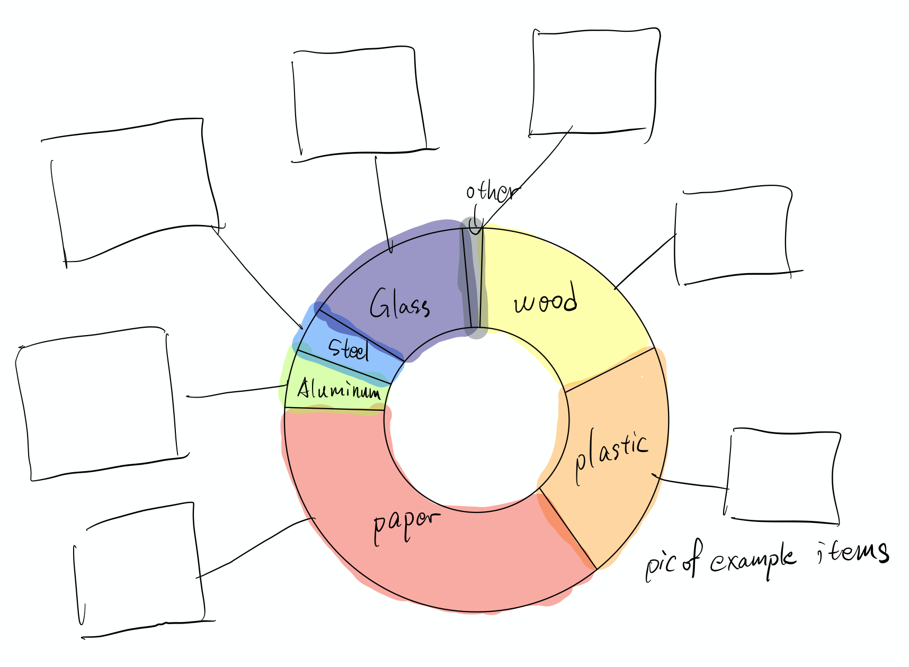
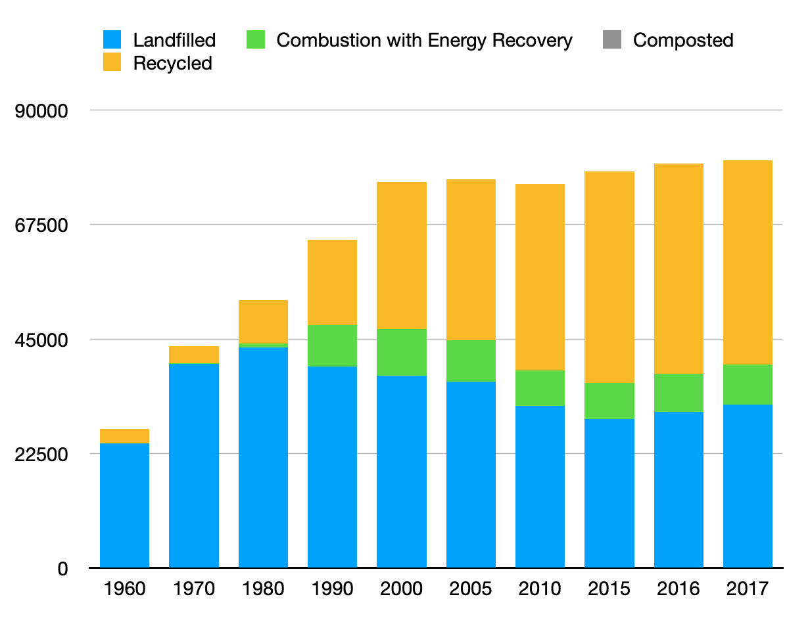
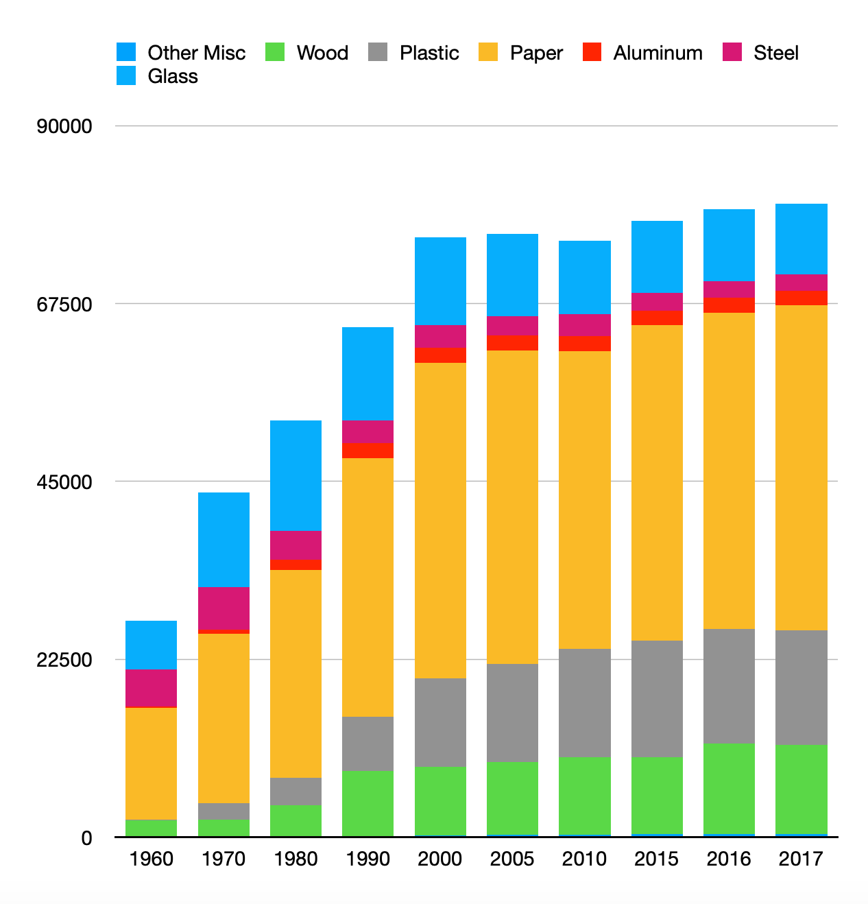
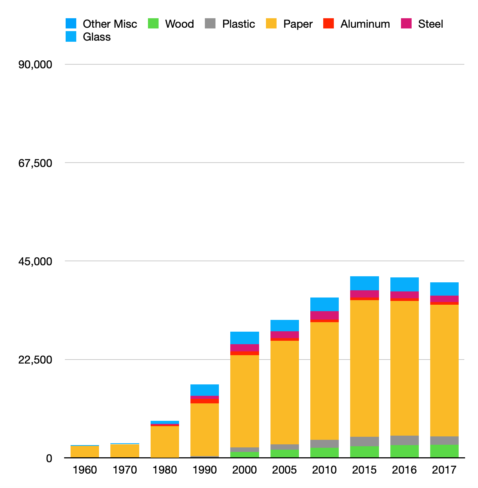
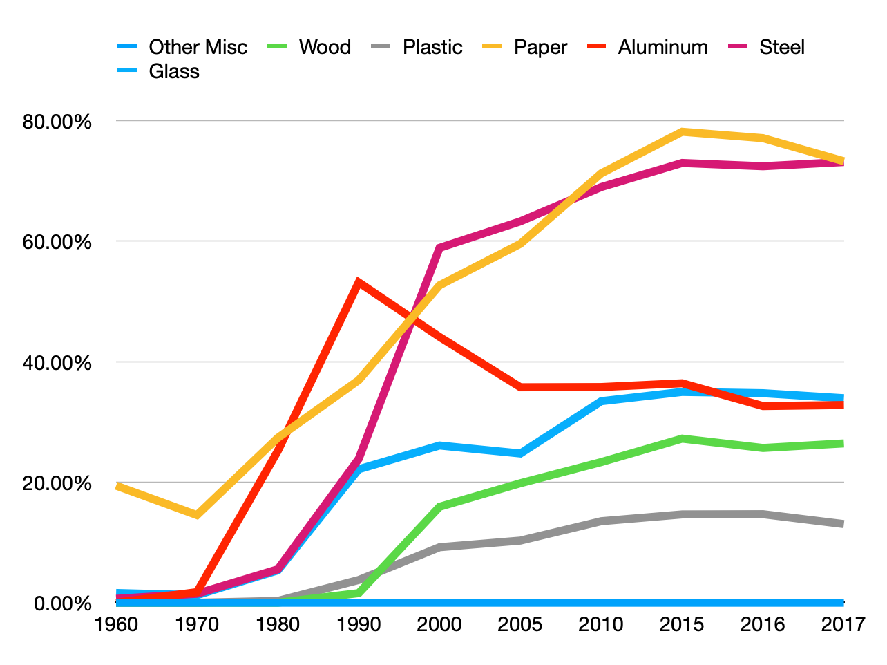

# Final Project Part I

## Introduction & Outline

### Story Title
Where does our "unboxing experience" end up?

### Topic Choice
A lot of people enjoy the unboxing experience after purchases of new items. I'm also one of them. However, as I accidentally stumbled upon the amount of waste generated in order to provide our unboxing experience. In fact, container and packaging waste account for 29.9% of total solid wasted generated in the United States. At 80,080 thousand metric tons, that's a lot of waste, so I'm curious about how these waste are disposed and what are the potential harms. Finally, what're some of the implications from how container and packaging waste are disposed.

### Story Arc

#### What are container and packaging waste
Graphic illustration of what are they and where do they come from

#### How are they disposed overall
Break down of the disposal methods in total count
Highlight that recycle is the best disposal method

#### The historical record of container and packaging waste generated
Stacked bar chart showing amount of waste generated for each category

#### How much is recycled
Stacked bar chart of actual amount recycled and line chart showing recycling rate

#### Potential harm of different disposal method
The harm analysis is provided in [this report](https://www.sasb.org/wp-content/uploads/2019/08/RT0204_CP_Brief1.pdf) published by Sustainability Accounting Standards Board in 2019.
* Recycle - processing cost and potential pollution during the recycling process
* Combustion with energy recovery - greenhouse gas and/or harmful gas emission
* Landfill - soil and water pollution

#### Disposal in 2017
Tree map showing methods and volume of disposal by category by method in 2017

#### Implications
* Promote use of recycable packaging materials
* Simplify packaging to reduce waste generation

### Delivery Format
The data story will be presented using Shorthand.

## Data Source
The main source of data comes from US Environmental Protection Agency (USEPA), which provides data on total volume of container and packaging waste.
The data can be found on [Environmental Protection Agency](https://www.epa.gov/facts-and-figures-about-materials-waste-and-recycling/containers-and-packaging-product-specific-data). A copy is also provided [`final project.pdf`](final_project_data.pdf).

## Initial Sketch

#### What are container and packaging waste

#### How are they disposed overall

#### The historical record of container and packaging waste generated

#### How much is recycled

#### Potential harm of different disposal method
No figures needed

#### Disposal in 2017
<iframe src='https://flo.uri.sh/visualisation/3331865/embed' frameborder='0' scrolling='no' style='width:100%;height:600px;'></iframe>

## User Research

### Target audience
The main target audience is general consumers who buy things that come with containers and packages. The purpose of this story is to raise consumer awareness of how much waste is generated simply due to packaging. The expected result is that consumers will be more aware of the package that comes with the products they purchase, and whenever possible, choose packagins that are more sustainable.

### How to identify representative individuals
By looking at my personal connections, I can choose indivuals with different buying habits: by type of product they purchase and by how much they value aesthetics of packaging and the unboxing experience.

### Interview question
* What did you learned from the storyline and visualizations?
* What was your feeling after reading the story?
* What part of the story is confusing or unintuitive to you?
* How do you like the aesthetics and color use of the sketch?
* Are there anything you would like to change, either to the storyline or the presentation?

Due to time constrains, review scripts and take away messages are not recorded.
